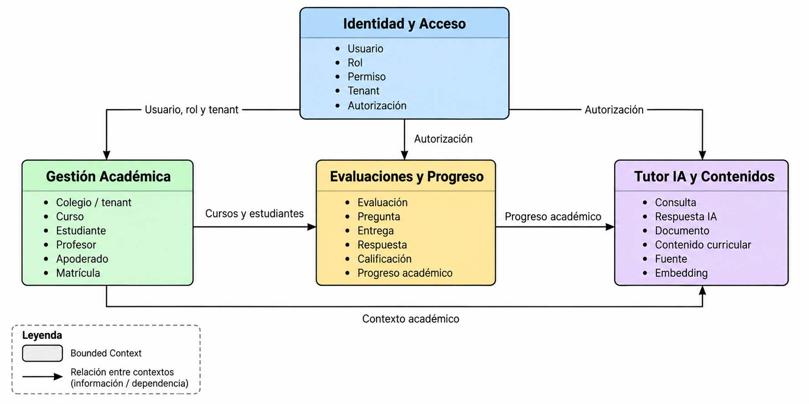

# Bounded Contexts — AulaViva

## Introducción

Para organizar las principales responsabilidades del dominio de AulaViva se definieron cuatro bounded contexts. Cada contexto establece una frontera clara sobre los conceptos y reglas que administra dentro de la plataforma.

Los contextos definidos son:

1. Gestión Académica.
2. Evaluaciones y Progreso.
3. Tutor IA y Contenidos.
4. Identidad y Acceso.

---

## 1. Gestión Académica

### Responsabilidad

Gestionar la estructura académica de cada colegio y las relaciones entre cursos, estudiantes, profesores y apoderados.

### Conceptos principales

- Colegio / tenant.
- Curso.
- Estudiante.
- Profesor.
- Apoderado.
- Matrícula.

### Límites

No gestiona evaluaciones, calificaciones ni consultas realizadas al Tutor IA.

### Relaciones

Proporciona información de cursos, estudiantes y profesores al contexto de **Evaluaciones y Progreso**.

También proporciona contexto académico a **Tutor IA y Contenidos**.

---

## 2. Evaluaciones y Progreso

### Responsabilidad

Gestionar el ciclo de vida de las evaluaciones, desde su creación hasta la entrega de respuestas, corrección y seguimiento del progreso académico.

### Conceptos principales

- Evaluación.
- Pregunta.
- Entrega.
- Respuesta.
- Calificación.
- Progreso académico.

### Límites

No administra la estructura de cursos y usuarios ni genera respuestas mediante inteligencia artificial.

### Relaciones

Utiliza información de **Gestión Académica** para relacionar evaluaciones con cursos y estudiantes.

Puede proporcionar información académica relevante a **Tutor IA y Contenidos** para contextualizar el apoyo entregado al estudiante.

---

## 3. Tutor IA y Contenidos

### Responsabilidad

Gestionar las consultas académicas realizadas por los estudiantes y generar respuestas contextualizadas mediante RAG.

### Conceptos principales

- Consulta.
- Respuesta IA.
- Documento.
- Contenido curricular.
- Fuente.
- Embedding.

### Límites

No modifica evaluaciones, calificaciones ni la estructura académica de los colegios.

### Relaciones

Obtiene contexto desde **Gestión Académica** y puede utilizar información relevante proveniente de **Evaluaciones y Progreso**.

---

## 4. Identidad y Acceso

### Responsabilidad

Gestionar los roles, permisos y pertenencia de los usuarios a cada tenant de AulaViva.

La autenticación de los usuarios se delega al servicio externo Amazon Cognito, mientras AulaViva mantiene las reglas necesarias para autorización y aislamiento entre tenants.

### Conceptos principales

- Usuario.
- Rol.
- Permiso.
- Tenant.
- Autorización.

### Límites

No administra cursos, evaluaciones, calificaciones ni contenido utilizado por el Tutor IA.

### Relaciones

Proporciona información de usuario, rol y tenant a los demás contextos para determinar qué operaciones puede realizar cada usuario.

---

## Context Map

El siguiente mapa representa las relaciones y dependencias entre los bounded contexts definidos para AulaViva.

